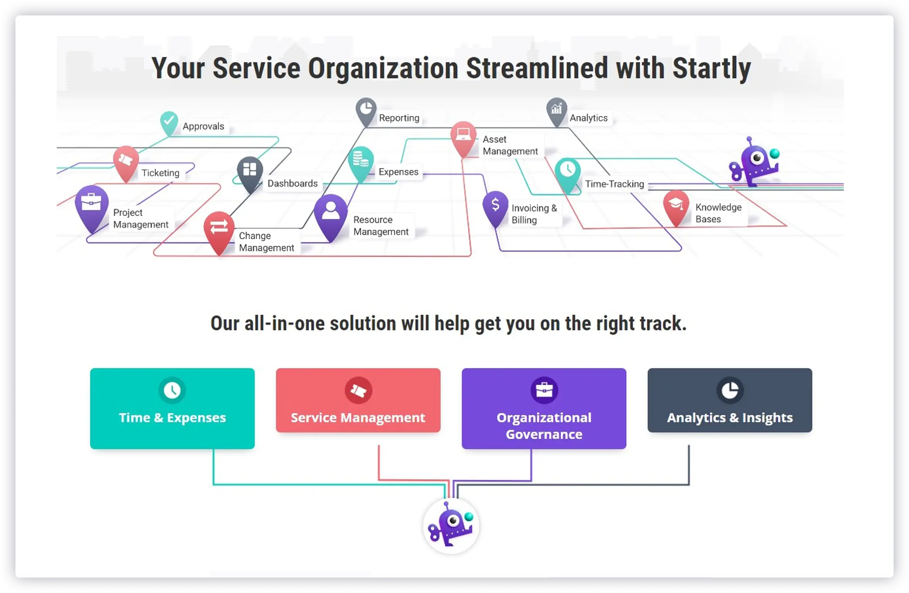
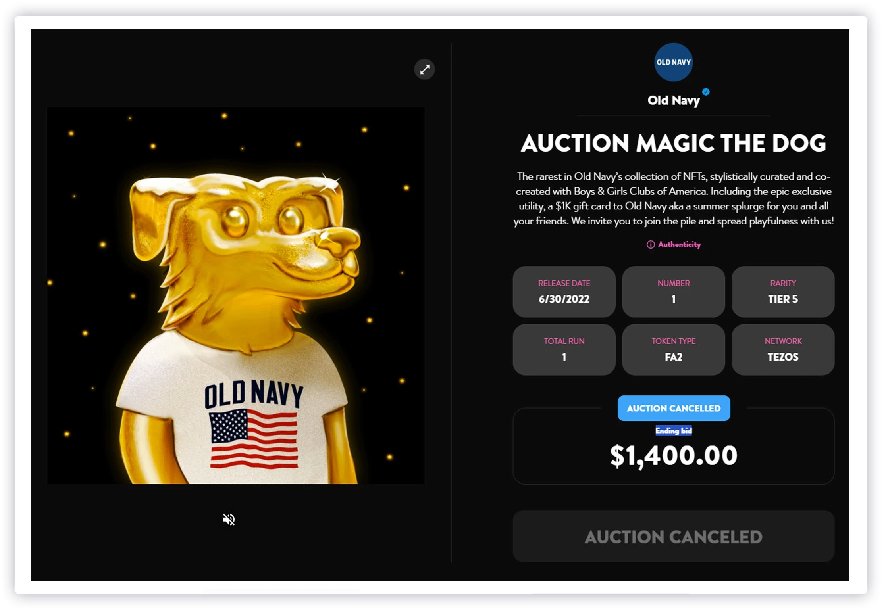
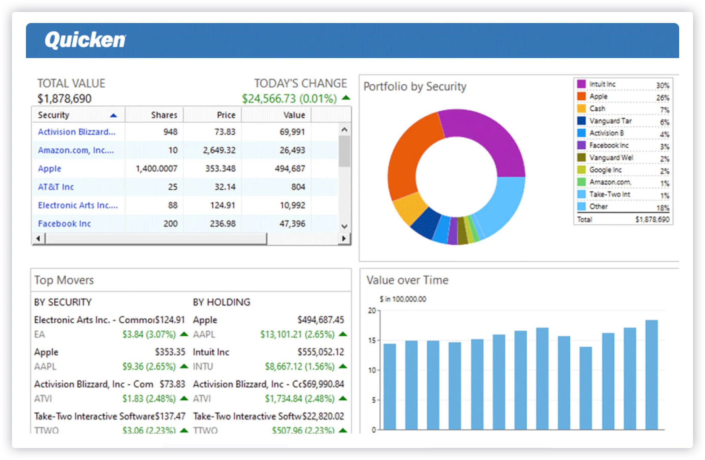

## Startly Labs
Startly was developed to streamline service company management, including resource, customer, project, and asset management.
- 
- Tags: Category 1
- Badges:
  - Badge [blue]
- Buttons:
  - Go Details [/detail/startly]

## Social Sweet
Sweet.io (or Sweet for short) is an NFT platform established in New York in 2016 focused on enabling NFTs to be used extensively in the commerce world. With Sweet.io, you can gift, share, integrate, auction, gamify, and drop NFTs anywhere, even on e-commerce stores. You can also get SUGAR tokens from the app by simply listening to music.
- 
- Tags: Category 2
- Badges:
  - Badge [blue]
- Buttons:
  - Go Details [/detail/sweet]

## Quicken
Quicken is a personal finance management software and mobile app that helps individuals and small businesses manage their financial activities. It offers features such as budgeting, expense tracking, bill payment, investment tracking, and tax preparation.
- 
- Tags: Category 2
- Badges:
  - Badge [blue]
- Buttons:
  - Go Details [/detail/quicken]